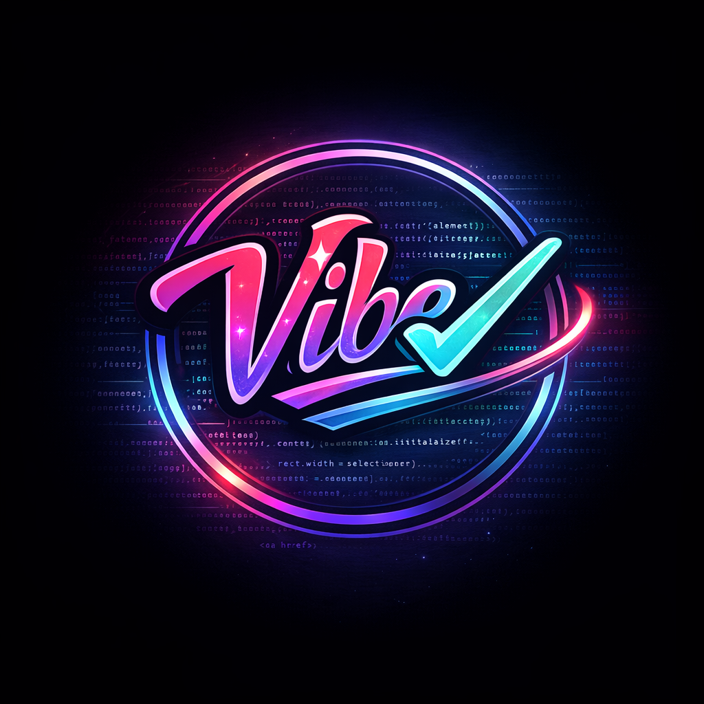

<p align="center">
  
</p>

<h1 align="center">VibeCheck</h1>

<p align="center">
  <strong>AI Code Verification for the Vibe Coding Era</strong>
</p>

<p align="center">
  <em>Your AI wrote the code. VibeCheck makes sure it actually works.</em>
</p>

<p align="center">
  <a href="https://www.npmjs.com/package/vibecheck-ai"></a>
  <a href="https://marketplace.visualstudio.com/items?itemName=vibecheck.vibecheck"></a>
  <a href="LICENSE.md"></a>
  <a href="https://github.com/VibeCheckOfficial/Vibecheck-AI-/actions"></a>
</p>

<p align="center">
  <a href="#the-problem">Problem</a> •
  <a href="#how-it-works">Solution</a> •
  <a href="#installation">Install</a> •
  <a href="#features">Features</a> •
  <a href="#documentation">Docs</a> •
  <a href="#contributing">Contributing</a>
</p>

---

## The Problem

You're shipping code faster than ever with AI assistance—Cursor, Copilot, Claude, ChatGPT. But there's a dirty secret nobody talks about:

**AI-generated code passes every traditional check.** Linting? ✅ TypeScript? ✅ Code review? Looks legit.

Then it hits production and you discover the API endpoint never existed, the error handler swallows everything, and the dashboard shows hardcoded data.

```typescript
// This code looks perfect. Linter passes. TypeScript happy. PR approved.

async function getUser(id: string): Promise<User> {
  const response = await fetch(`/api/v2/users/${id}`);  // ❌ Endpoint doesn't exist
  return response.json();
}

async function processOrder(order: Order): Promise<void> {
  try {
    await chargeCustomer(order);
    await sendConfirmation(order);
  } catch (e) {
    // TODO: handle this later  // ❌ Payment failures silently ignored
  }
}

function getRevenueMetrics(): DashboardData {
  return { 
    users: 1247, 
    revenue: 84350,
    growth: 23.5 
  };  // ❌ Hardcoded. None of this is real.
}
```

We call these **fake features**—code that compiles, passes CI, and ships to production without ever working.

**You've shipped them. We all have.**

---

## How It Works

VibeCheck catches what linters miss. It understands your codebase and detects AI-generated hallucinations before they ship.

```bash
$ vibecheck scan

⛔ FAKE FEATURE DETECTED
   src/api/users.ts:4
   ├─ API endpoint /api/v2/users/{id} does not exist in your codebase
   ├─ The AI generated a plausible URL that will 404 at runtime
   └─ Suggestion: Check routes.ts for available endpoints

⚠️ SILENT FAILURE RISK  
   src/orders/process.ts:11
   ├─ Empty catch block in payment flow
   ├─ chargeCustomer() errors will be swallowed silently
   └─ Suggestion: Add proper error handling or rethrow

⚠️ MOCK DATA IN PRODUCTION
   src/dashboard/metrics.ts:16
   ├─ Hardcoded return values detected
   ├─ getRevenueMetrics() returns static data, not real values
   └─ Suggestion: Connect to actual data source

────────────────────────────────────────────────────
  3 issues found │ 1 critical │ 2 warnings
────────────────────────────────────────────────────
```

---

## Installation

### CLI (Recommended)

```bash
# npm
npm install -g vibecheck-ai

# pnpm
pnpm add -g vibecheck-ai

# yarn
yarn global add vibecheck-ai
```

### VS Code Extension

Search **"VibeCheck"** in VS Code Extensions, or [install from marketplace](https://marketplace.visualstudio.com/items?itemName=vibecheck.vibecheck).

### GitHub Action

```yaml
- uses: VibeCheckOfficial/vibecheck-action@v1
  with:
    fail-on-error: true
```

---

## Quick Start

```bash
# Initialize VibeCheck in your project
vibecheck init

# Run a scan
vibecheck scan

# Scan with auto-fix suggestions
vibecheck scan --fix

# Deep scan (cross-file analysis)
vibecheck scan --deep
```

---

## Features

### 🔍 Detection Engines

| Engine | What It Catches |
|--------|-----------------|
| **Fake Feature Detection** | Code that compiles but never works |
| **API Hallucination Scanner** | Phantom endpoints that don't exist |
| **Mock Data Finder** | Hardcoded values pretending to be real |
| **Error Handler Analysis** | Silent failures and empty catch blocks |
| **Secrets Scanner** | Accidentally committed credentials |
| **Auth Configuration Scanner** | Insecure authentication patterns |
| **Route Scanner** | Mismatched API routes |
| **Environment Variable Checker** | Undefined env var references |

### 🛡️ Agent Firewall

Real-time guardrails that intercept AI suggestions **before** they enter your codebase.

```typescript
// vibecheck.config.ts
export default {
  firewall: {
    mode: 'enforce',  // 'observe' | 'enforce' | 'lockdown'
    rules: {
      blockFakeEndpoints: true,
      requireErrorHandling: true,
      preventMockData: true
    }
  }
}
```

### 🎯 Reality Mode

Playwright-powered testing that **actually runs your code** to verify it works.

```bash
vibecheck reality --target src/api/
```

### 🔧 Auto-Fix

One-click fixes for detected issues.

```bash
vibecheck scan --fix --apply
```

---

## Supported Languages

| Language | Support |
|----------|---------|
| TypeScript | ✅ Full |
| JavaScript | ✅ Full |
| JSX/TSX | ✅ Full |
| Python | ✅ Full |
| Go | ✅ Full |
| Rust | ✅ Full |

---

## Configuration

Create `vibecheck.config.ts` in your project root:

```typescript
import { defineConfig } from 'vibecheck-ai';

export default defineConfig({
  // Scanning options
  include: ['src/**/*.ts', 'src/**/*.tsx'],
  exclude: ['**/*.test.ts', '**/node_modules/**'],
  
  // Detection sensitivity
  strictMode: true,
  
  // Firewall settings
  firewall: {
    enabled: true,
    mode: 'enforce'
  },
  
  // Output format
  format: 'pretty',  // 'pretty' | 'json' | 'sarif'
});
```

---

## CLI Reference

```bash
vibecheck <command> [options]

Commands:
  scan              Scan project for issues
  init              Initialize VibeCheck in project
  reality           Run Reality Mode verification
  firewall          Configure Agent Firewall
  doctor            Diagnose VibeCheck setup

Options:
  --help            Show help
  --version         Show version
  --config <path>   Path to config file
  --format <type>   Output format (pretty|json|sarif)
  --fix             Show auto-fix suggestions
  --apply           Apply auto-fixes
  --deep            Enable deep cross-file analysis
  --ci              CI mode (non-interactive)
```

---

## Documentation

- [Architecture Overview](docs/architecture/ARCHITECTURE.md)
- [Scanner Architecture](docs/architecture/SCANNER_ARCH.md)
- [Configuration Guide](docs/specs/CONFIG.md)
- [Agent Firewall Spec](docs/specs/agent-firewall.md)
- [Reality Mode Spec](docs/specs/REALITY_MODE_SPEC.md)
- [Truthpack System](docs/specs/truthpack-spec.md)
- [Known Limitations](docs/KNOWN_LIMITATIONS.md)

---

## Project Structure

```
vibecheck/
├── apps/
│   ├── cli/                 # CLI tool (vibecheck command)
│   ├── mcp-server/          # MCP server for AI integrations
│   └── vscode-extension/    # VS Code extension wrapper
├── packages/
│   ├── core/                # Core detection engine
│   ├── vscode-extension/    # VS Code extension implementation
│   ├── mcp-server/          # MCP server implementation
│   ├── github-action/       # GitHub Action
│   ├── shared-types/        # Shared TypeScript types
│   ├── shared-config/       # Configuration utilities
│   ├── shared-utils/        # Shared utilities
│   └── typescript-config/   # Shared TS configs
└── docs/                    # Documentation
```

---

## Contributing

We welcome contributions! Please see our [Contributing Guide](CONTRIBUTING.md) for details.

```bash
# Clone the repo
git clone https://github.com/VibeCheckOfficial/Vibecheck-AI-.git
cd Vibecheck-AI-

# Install dependencies
pnpm install

# Build all packages
pnpm build

# Run tests
pnpm test

# Run the CLI locally
pnpm --filter vibecheck-ai start
```

---

## License

This project is licensed under the [Business Source License 1.1](LICENSE.md).

**What this means:**

- ✅ **Free for personal use and evaluation**
- ✅ **Free for small teams (< 10 developers)**
- ✅ **Source code is fully visible**
- ❌ **Cannot be used to create competing commercial products**
- 🔄 **Converts to Apache 2.0 after 4 years**

For enterprise licensing, contact [enterprise@vibecheckai.dev](mailto:enterprise@vibecheckai.dev).

---

## Cloud Features (VibeCheck Pro)

The open-source CLI provides full local scanning capabilities. [VibeCheck Pro](https://vibecheckai.dev) adds:

- ☁️ Cloud sync & team dashboards
- 👥 Team collaboration & shared policies
- 📊 Trend analysis & historical data
- 🔗 Webhook integrations
- 🎫 Priority support

---

<p align="center">
  
</p>

<p align="center">
  <strong>Stop shipping fake features.</strong><br/>
  Built for developers who ship fast and need to ship safe.
</p>

<p align="center">
  <a href="https://vibecheckai.dev">Website</a> •
  <a href="https://discord.gg/vibecheck">Discord</a> •
  <a href="https://x.com/VibeCheck_AI">Twitter</a>
</p>
