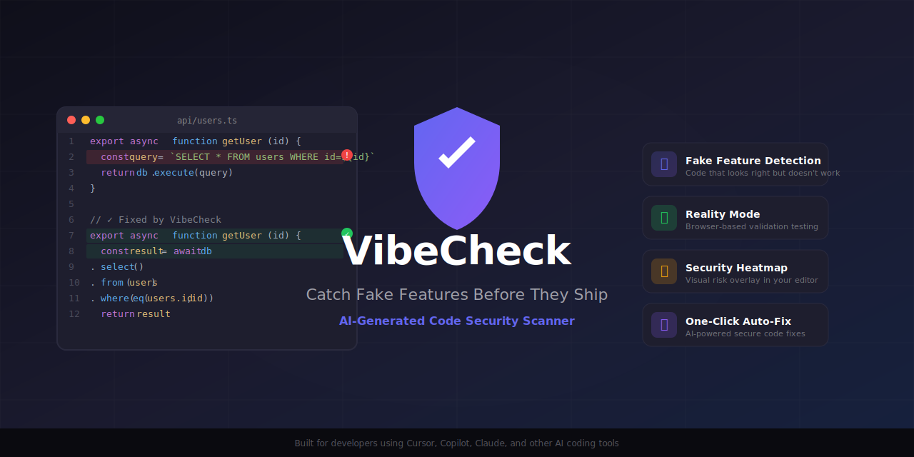
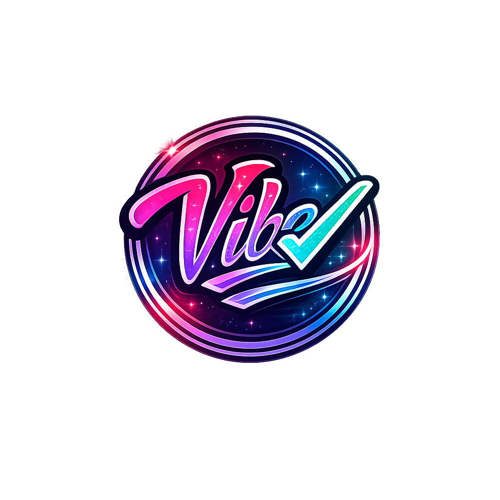

<p align="center">
  
</p>

<h1 align="center">VibeCheck for VS Code</h1>

<p align="center">
  <strong>AI Code Verification for the Vibe Coding Era</strong>
</p>

<p align="center">
  <em>Your AI wrote the code. VibeCheck makes sure it actually works.</em>
</p>

<p align="center">
  <a href="https://marketplace.visualstudio.com/items?itemName=vibecheck.vibecheck"></a>
  <a href="https://marketplace.visualstudio.com/items?itemName=vibecheck.vibecheck"></a>
  <a href="https://marketplace.visualstudio.com/items?itemName=vibecheck.vibecheck"></a>
  <a href="https://github.com/VibeCheckOfficial/Vibecheck-AI-"></a>
</p>

<p align="center">
  <a href="#the-problem">Problem</a> •
  <a href="#see-it-in-action">Demo</a> •
  <a href="#features">Features</a> •
  <a href="#quick-start">Quick Start</a> •
  <a href="#commands">Commands</a>
</p>

---

## The Problem

AI coding tools write fast, but they ship bugs. Most failures aren't syntax errors—they're **hallucinations**:

- API endpoints that don't exist
- Environment variables that aren't defined
- Error handlers that swallow everything
- Hardcoded mock data in production code
- Auth checks that don't match the backend

**VibeCheck catches what linters miss.**

---

## See It In Action

<p align="center">
  
</p>

---

## Features

### 🔍 Real-Time Scanning

Scan your code instantly and get feedback right in the editor.

- **Inline Diagnostics** — Issues appear in the Problems panel
- **CodeLens Warnings** — Contextual warnings above functions
- **Hover Details** — Full issue information on hover
- **Quick Fixes** — One-click fixes for common issues

### 🛡️ Agent Firewall

Real-time guardrails that intercept AI suggestions **before** they enter your codebase.

| Mode | Behavior |
|------|----------|
| **Observe** | Log issues but allow changes |
| **Enforce** | Block risky changes with warnings |
| **Lockdown** | Block ALL write operations |

### 🎯 Detection Engines

| Engine | What It Catches |
|--------|-----------------|
| **Fake Feature Detection** | Code that compiles but never works |
| **API Hallucination Scanner** | Phantom endpoints that don't exist |
| **Mock Data Finder** | Hardcoded values pretending to be real |
| **Error Handler Analysis** | Silent failures and empty catch blocks |
| **Secrets Scanner** | Accidentally committed credentials |
| **Route Scanner** | Mismatched API routes |
| **Environment Variable Checker** | Undefined env var references |

### 📊 Dashboard & Reports

- **Workspace Health Dashboard** — Overall project status
- **Findings Panel** — All issues organized by severity
- **Truthpack Viewer** — Live index of routes, env vars, auth rules
- **History Tracking** — Monitor changes over time
- **Ship Score** — Production readiness at a glance

---

## Quick Start

### 1. Install the Extension

Search **"VibeCheck"** in VS Code Extensions, or click Install above.

### 2. Install the CLI

```bash
npm install -g vibecheck-ai
```

### 3. Initialize Your Project

```bash
vibecheck init
```

### 4. Scan Your Code

Open the Command Palette (`Ctrl+Shift+P` / `Cmd+Shift+P`) and run:

```
VibeCheck: Scan Project
```

That's it! Issues appear inline, in the Problems panel, and in the VibeCheck sidebar.

---

## Commands

| Command | Shortcut | Description |
|---------|----------|-------------|
| `VibeCheck: Scan Project` | — | Full project scan |
| `VibeCheck: Validate Current Change` | `Cmd+Shift+C` | Validate current file |
| `VibeCheck: Toggle Firewall` | `Cmd+Shift+V` | Enable/disable firewall |
| `VibeCheck: Build Enhanced Prompt` | `Cmd+Shift+P` | Build context-aware AI prompt |
| `VibeCheck: Refresh Truthpack` | `Cmd+Shift+R` | Refresh project truth data |
| `VibeCheck: Set Firewall Mode` | — | Switch observe/enforce/lockdown |
| `VibeCheck: Show Truthpack Viewer` | — | Browse project truth data |
| `VibeCheck: Show Dashboard` | — | Open health dashboard |

---

## Configuration

Add to your VS Code `settings.json`:

```json
{
  "vibecheck.firewallEnabled": true,
  "vibecheck.firewallMode": "enforce",
  "vibecheck.strictMode": true,
  "vibecheck.autoRefresh": true,
  "vibecheck.highlightGhostRoutes": true,
  "vibecheck.highlightGhostEnvVars": true
}
```

---

## Supported Languages

| Language | Support |
|----------|---------|
| TypeScript | Full |
| JavaScript | Full |
| JSX/TSX | Full |
| Python | Full |
| Go | Full |
| Rust | Full |

---

## Requirements

| Requirement | Version |
|-------------|---------|
| VS Code | 1.85.0+ |
| Node.js | 18+ (for CLI) |

---

## Privacy & Security

- **Local-First** — All scanning runs locally on your machine
- **No Code Upload** — Your code never leaves your computer
- **No Telemetry** — Optional anonymous usage stats only

---

## Links

- [GitHub Repository](https://github.com/VibeCheckOfficial/Vibecheck-AI-)
- [Documentation](https://vibecheckai.dev/docs)
- [Report Issues](https://github.com/VibeCheckOfficial/Vibecheck-AI-/issues)
- [Website](https://vibecheckai.dev)

---

<p align="center">
  
</p>

<p align="center">
  <strong>Stop shipping fake features.</strong><br/>
  Built for developers who ship fast and need to ship safe.
</p>

<p align="center">
  <a href="https://vibecheckai.dev">Website</a> •
  <a href="https://discord.gg/vibecheck">Discord</a> •
  <a href="https://x.com/VibeCheck_AI">Twitter</a>
</p>
